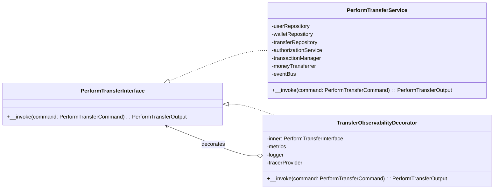
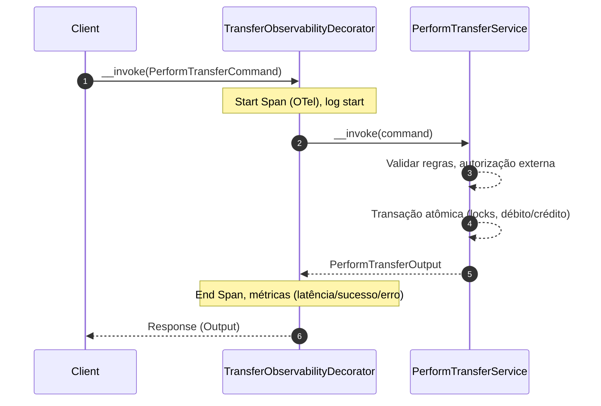
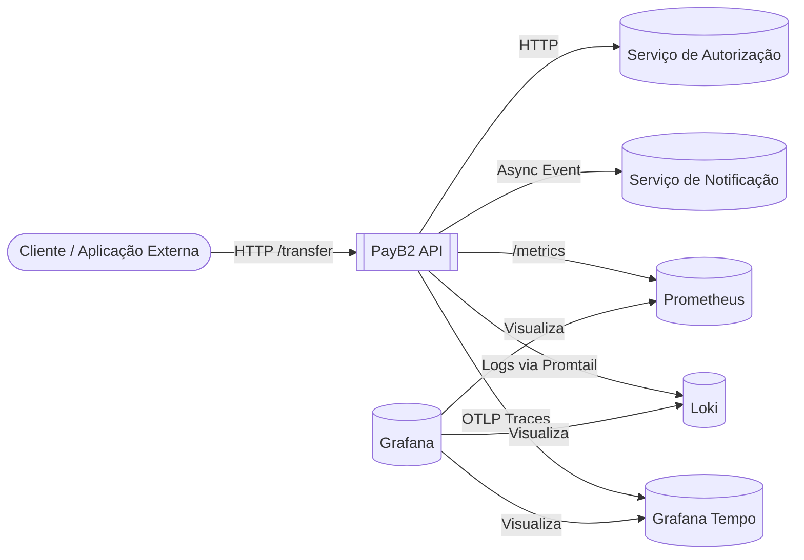
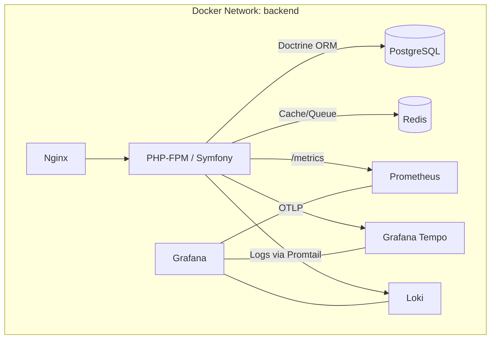

# Contexto de Domínio – Sistema de Transferências Financeiras

Este documento apresenta a visão de domínio e o desenho de solução para o sistema de Transferências Financeiras (PHP 8 / Symfony), seguindo Clean Architecture e DDD.

## 1. Espaço do Problema (O "Que")
### Caso de Uso: Perform Transfer
Um usuário (Payer) envia dinheiro para outro usuário (Payee). O sistema deve:
- Validar identidades (Payer/Payee) e permissões (tipo de usuário apto a enviar).
- Verificar saldo suficiente no Wallet do Payer.
- Executar a operação de débito/crédito de forma **atômica** (transação única, com locks pessimistas) para evitar condições de corrida.
- Persistir a Transferência e publicar evento de conclusão.

### Regras de Negócio
- Um usuário não pode transferir para si mesmo.
- Apenas usuários do tipo “comum” podem enviar (ex.: lojistas não enviam).
- A transferência só ocorre se o **Wallet** do Payer tiver saldo suficiente.
- Transação deve ser **atômica**: débito no Wallet do Payer e crédito no Wallet do Payee acontecem no mesmo contexto transacional.
- Em caso de falha (autorização externa, saldo, validação), a operação é abortada e nenhum estado parcial é persistido.

### Linguagem Ubíqua
- **Wallet**: carteira associada ao usuário, com saldo em dinheiro.
- **Payer**: quem envia o dinheiro.
- **Payee**: quem recebe o dinheiro.
- **Transaction**: operação atômica de débito/crédito de valores entre duas carteiras.
- **Authorization**: verificação externa (serviço de autorização) que permite ou nega a transferência.
- **Transfer**: entidade de domínio que registra uma tentativa/operação de transferência com status.

## 2. Modelagem da Solução (O "Como")
### Clean Architecture + DDD
- **Domain**: entidades, VOs, enums e regras. Sem dependência de framework.
- **Application**: orquestra use cases e portas (repositórios/serviços). Ex.: `PerformTransfer` valida, autoriza, usa transação, persiste, publica evento.
- **Infrastructure**: adapters (HTTP, Doctrine, Messenger, Observabilidade).

### Decorator de Observabilidade
Utilizamos o **Decorator Pattern** (`TransferObservabilityDecorator`) para encapsular o use case `PerformTransfer`. Objetivos:
- Adicionar **tracing OpenTelemetry** (spans de início/fim, latência, erro) sem inserir lógica de observabilidade no **núcleo de negócio**.
- Preservar **Separation of Concerns**: o caso de uso continua puro e independente de infraestrutura.
- Permitir evolução da observabilidade (OTel, Prometheus, Loki) sem tocar em Domain/Application.

Benefícios:
- Baixo acoplamento, alta testabilidade.
- Observabilidade consistente e centralizada na borda (Infrastructure).

## 3. Modelagem Visual (Mermaid.js)
### Diagrama de Classes


### Diagrama de Sequência


## 4. Contexto de Infraestrutura
### Pipeline de Observabilidade
- **OpenTelemetry SDK** cria spans atrelados às operações de aplicação (via Decorator e instrumentação nas bordas: HTTP/Messenger/HttpClient).
- **OTLP Exporter (HTTP)** envia os spans para **Grafana Tempo**: endpoint interno em Docker `http://tempo:4318` (ou `http://localhost:4318` em cenários locais).
- **Grafana** visualiza os traces (datasource Tempo) e correlaciona com métricas (Prometheus) e logs (Loki).

### Notas de Deploy (Docker Compose)
- App, Grafana, Tempo, Prometheus e Loki compartilham a rede `backend`.
- O Decorator permanece agnóstico ao provider: a DI liga `TracerProviderInterface` a um provider real (SDK) ou noop, conforme ambiente.

## 5. Injeção de Dependências (Resumo)
- **Problema**: Autowiring de `TracerProviderInterface` requer um serviço concreto.
- **Soluções**:
  - Ambiente com tracing real: registrar `OpenTelemetry\SDK\Trace\TracerProvider` via **Factory** (ex.: `Bootstrap::init()` que cria o `SpanExporter` OTLP + `BatchSpanProcessor`) e aliasar para `OpenTelemetry\API\Trace\TracerProviderInterface`.
  - Ambiente sem tracing: usar `OpenTelemetry\API\Trace\NoopTracerProvider` e aliasar a interface para o noop.

Assim, o `TransferObservabilityDecorator` continua recebendo `TracerProviderInterface` sem conhecer implementações, preservando a pureza do core.

## 6. Visualização com C4 Model (Níveis de Abstração)
O C4 Model fornece uma visão progressiva do sistema, do contexto até componentes internos. Abaixo, representamos em Mermaid (aproximação).

### C4: System Context


### C4: Containers


### C4: Components (na aplicação)
```mermaid
flowchart LR
  Controller[TransferController]
  UseCase[PerformTransfer (Application)]
  Decorator[TransferObservabilityDecorator (Infrastructure)]
  DomainEntities[(Domain: User, Wallet, Transfer)]
  Repos[Repositories (Doctrine Adapters)]
  TxMgr[TransactionManager]
  AuthPort[Authorization Service Port]
  EventBus[Message Bus]

  Controller --> Decorator
  Decorator --> UseCase
  UseCase --> DomainEntities
  UseCase --> Repos
  UseCase --> TxMgr
  UseCase --> AuthPort
  UseCase --> EventBus
```

## 7. Diagrama de Caso de Uso (Visual)
Representação simplificada do caso de uso "Perform Transfer".

```mermaid
flowchart TB
  actorPayer([Actor: Payer])
  actorPayee([Actor: Payee])
  system[[Sistema: PayB2]]

  subgraph UC[Caso de Uso: Perform Transfer]
    step1[Enviar requisição de transferência]
    step2[Validar identidades e regras do domínio]
    step3[Autorizar externamente]
    step4[Executar transação atômica (débito/crédito)]
    step5[Persistir e publicar evento]
    step6[Retornar resultado]
  end

  actorPayer --> step1
  step1 --> system
  system --> step2 --> step3 --> step4 --> step5 --> step6
  step6 --> actorPayer
  step5 --> actorPayee
```

---
Este documento prioriza clareza de fronteiras e a justificativa das decisões. O resultado é um sistema com domínio limpo, orquestração clara e observabilidade robusta, aplicável a ambientes de produção com a stack Grafana Tempo/Prometheus/Loki.
